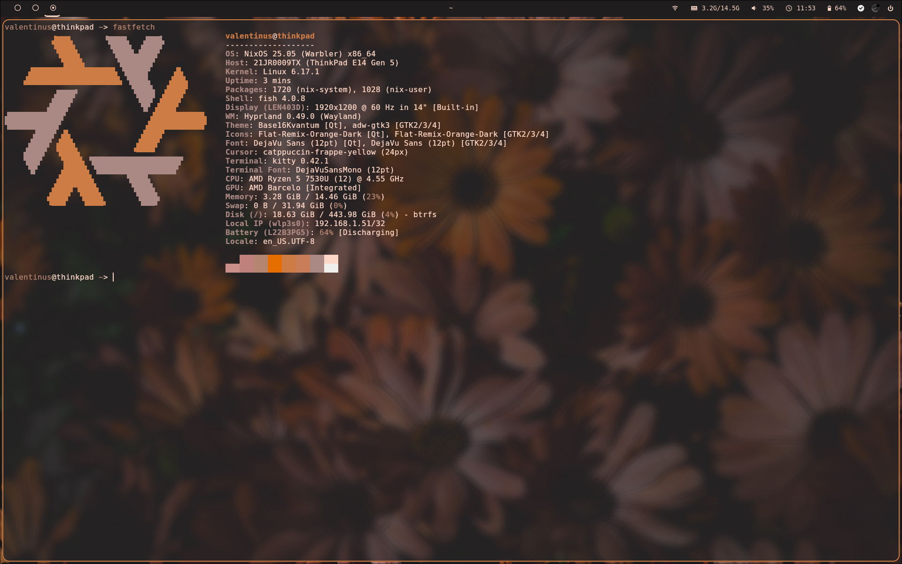
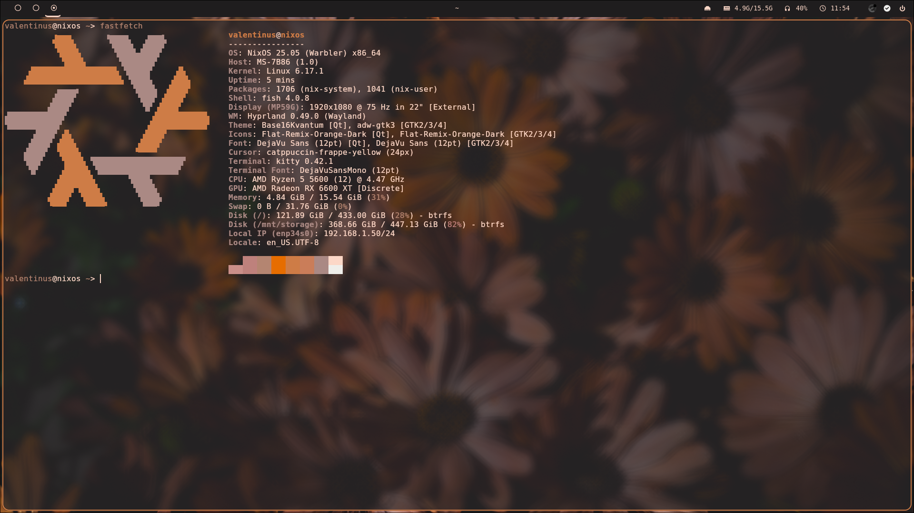

# Valen's dots

This repository contains my personal NixOS dotfiles. You can use it for reference purposes rather than for personal use.

## Configuration & Modules

| Name                    | Description                                    |
| ----------------------- | ---------------------------------------------- |
| [Assets](./assets)      | Has wallpapers and screenshots from hosts.     |
| [Hosts](./hosts)        | Host spesific configuration files.             |
| [Modules](./modules)    | Generic NixOS and home-manager configurations. |
| [Users](./users)        | home-manager user spesific configurations.     |
| [Disko](./hosts/disko)  | Disko configuration for hosts.                 |

## Hosts

| Name                         | Specs                                                     | Screenshot                      |
| ---------------------------- | --------------------------------------------------------- | --------------------------------|
| [Thinkpad](./hosts/thinkpad) | AMD Ryzen 5 7530U - AMD Barcelo [Integrated] - 16 GB RAM  |  |
| [Desktop](./hosts/desktop)   | AMD Ryzen 5 5600  - AMD RX 6600XT [Discrete] - 16 GB RAM  |   |

## Installation

- Fetch dotfiles.

```bash
git clone https://github.com/valeninki/dotfiles.nix.git 
```

Run preferred flake.

```bash
sudo nixos-rebuild switch --flake ./dotfiles.nix#desktop
```

## Special Thanks

- [Taha](https://github.com/mt190502)  - Gave me inspiraton for use NixOS and explained a lot of things.
- [Kreato](https://github.com/kreatoo) - Helped for troubleshooting Nix Flakes.
- [Yağız](https://github.com/saveside) - Referenced for host spesific settings.
