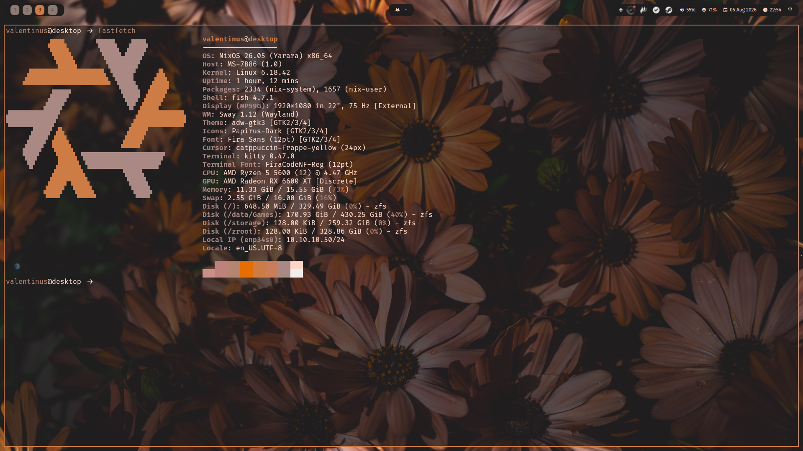
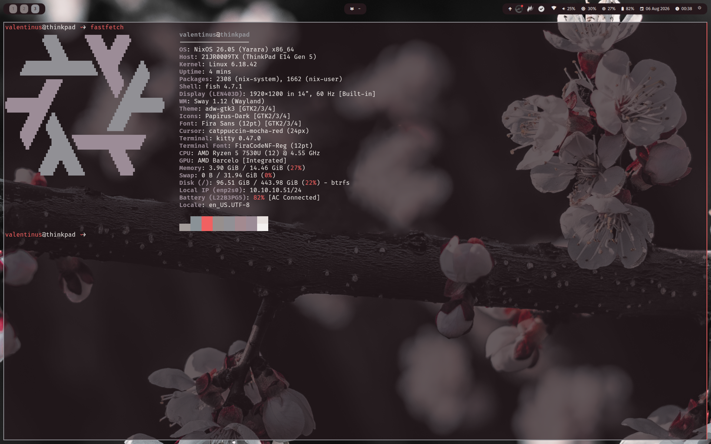

<p align="center">
  <a href="https://nixos.org">
    
  </a>
  
  
  
  
  
  
  
  
</p>

<h1 align="center">Valen's Dots</h1>

<p align="center"><b>A declarative NixOS flake for gaming, VMs and daily driving.</b></p>

---

## Philosophy / About

This repository contains my personal NixOS dotfiles, shared for reference and educational purposes rather than for direct reuse. The goal is a fully declarative, reproducible system that can be installed from scratch with a single flake.

The configuration is organized around three focus areas:

- **Gaming** -- Steam with library isolation, Sunshine game streaming, Moonlight client, and PrismLauncher.
- **Virtual Machines & Kubernetes** -- libvirtd with virt-manager, a ZFS dataset dedicated to VM images, and a k3s/k0sctl cluster across three VM hosts.
- **Daily Driving** -- a Sway + Quickshell desktop with Stylix theming, greetd auto-login, and Pipewire audio.

Security is treated as a first-class concern: `sudo` is disabled in favor of `doas`, secrets are managed with SOPS-nix, thinkpad uses LUKS full-disk encryption with Lanzaboote Secure Boot, and OpenSSH is hardened across all server hosts. Self-hosting is provided by a Garage S3 object storage node running on a Raspberry Pi 4.

---

## Showcase

<p align="center">
  <figure>
    
    <figcaption><b>desktop</b> -- Sway + Quickshell + Stylix</figcaption>
  </figure>
  &nbsp;&nbsp;
  <figure>
    
    <figcaption><b>thinkpad</b> -- mobile daily driver</figcaption>
  </figure>
</p>

---

## Features

**Gaming**
- Steam with `/data/Games` bind mount and firewall rules for Remote Play and dedicated server.
- Sunshine game streaming host with Moonlight client.
- PrismLauncher for modded Minecraft.

**Desktop**
- Sway (Wayland) with XWayland support, TR keyboard layout, and PiP sticky windows.
- Custom Quickshell panel: status bar, system tray, notifications, and OCR screenshots.
- Stylix system-wide theming: Fira fonts, Papirus icons, Catppuccin cursors, dark polarity, terminal opacity 0.7.
- greetd with tuigreet login and GNOME keyring.

**Storage / Disko**
- Desktop: ZFS dual-pool layout -- `zroot` (zstd, system datasets) and `storage` (lz4/zstd, dataset-specific recordsize: Games 1M, VMs 64K no-compression, Backups 1M).
- Thinkpad: LUKS full-disk encryption with btrfs subvolumes (root, home, nix-store, all zstd-compressed).
- Randomly encrypted swap on both desktop and thinkpad.
- Raspberry Pi: declarative Disko partitioning on the MMC block device.

**Audio**
- Pipewire with ALSA, PulseAudio, and JACK compatibility (including 32-bit libraries).
- Wireplumber session manager and easyeffects.

**Networking & VPN**
- AmneziaWG (obfuscated WireGuard) with obfuscation parameters stored in SOPS-encrypted secrets.
- Tailscale with client or server routing features per host.
- Mullvad VPN on desktop hosts.
- systemd-networkd with nftables firewall, DNS-over-TLS via Quad9, and BBR + fq congestion control.

**Security**
- `sudo` disabled, `doas` enabled across all hosts.
- SOPS-nix encrypted secrets with age keys derived from SSH host keys.
- Lanzaboote Secure Boot on thinkpad with sbctl-managed PKI.
- LUKS full-disk encryption on thinkpad.
- Hardened OpenSSH on server hosts (no password auth, no root login, no keyboard-interactive).

**VMs & Kubernetes**
- libvirtd with virt-manager and spice USB redirection.
- ZFS dataset `/data/VMs` with tuned recordsize and ownership for qemu-libvirtd.
- k3s, k0sctl, Kubernetes Helm, and Flux across three VM hosts with tuned performance profiles.

**Self-host**
- Garage S3 object storage on the Raspberry Pi with garage-webui dashboard.
- SOPS-templated credentials for RPC, admin, and metrics tokens.

**Performance**
- scx scheduler (`scx_bpfland`) on desktop and VM hosts.
- Linux kernel 6.18 on desktop hosts.
- tuned `latency-performance` profile on k8s worker nodes with TCP buffer tuning.
- Per-host CPU governor: performance (desktop, servers) or powersave (thinkpad).

**Quality**
- flake-parts modular flake structure.
- Pre-commit hooks: nixfmt, nil, deadnix, statix.
- Quickshell QML validation check.

---

## Hosts

| Name | Arch | User | Role | Disk | Security | Notes |
| --- | --- | --- | --- | --- | --- | --- |
| [desktop](./hosts/desktop) | x86_64 | valentinus | daily-driver + gaming | ZFS dual-pool (zroot + storage) | systemd-boot, Wake-on-LAN, S5 WoL trap | AMD Ryzen 5 5600 / RX 6600XT, Steam, Sunshine, scx_bpfland |
| [thinkpad](./hosts/thinkpad) | x86_64 | valentinus | mobile daily | LUKS + btrfs | Lanzaboote Secure Boot, fprintd, tlp | AMD Ryzen 5 7530U (Barcelo), AWG client, Tailscale client |
| [pi](./hosts/pi) | aarch64 | berry | self-host S3 node | Disko (MMC) | Tailscale server | Raspberry Pi 4, Garage S3, SOPS-managed passwords |
| [m1](./hosts/servers/m1) | x86_64 | zen | k8s control-plane VM | systemd-boot | base-vm-server | Tuned defaults |
| [w1](./hosts/servers/w1) | x86_64 | zen | k8s worker VM | systemd-boot | tuned k8s-master | latency-performance + TCP buffer tuning |
| [w2](./hosts/servers/w2) | x86_64 | zen | k8s worker VM | systemd-boot | tuned + AWG server | AmneziaWG server, systemd-networkd |

---

## Flake Inputs

| Input | Source | Purpose |
| --- | --- | --- |
| nixpkgs | `github:NixOS/nixpkgs/nixos-26.05` | Primary package set |
| unixpkgs | `github:NixOS/nixpkgs/nixos-unstable` | Unstable packages (exposed as `unixpkgs` specialArg) |
| valenpkgs | `git+https://git.valentinus.dev/valeninki/nixpkgs?ref=unstable` | Custom nixpkgs fork (follows nixpkgs) |
| home-manager | `github:nix-community/home-manager/release-26.05` | User-level configuration (follows nixpkgs) |
| flake-parts | `github:hercules-ci/flake-parts` | Modular flake structure (nixpkgs-lib follows unixpkgs) |
| sops-nix | `github:Mic92/sops-nix` | Encrypted secrets management (follows nixpkgs) |
| pre-commit-hooks | `github:cachix/git-hooks.nix` | Code quality: nixfmt, nil, deadnix, statix (follows unixpkgs) |
| lanzaboote | `github:nix-community/lanzaboote/v1.1.0` | Secure Boot support (follows nixpkgs) |
| nixos-hardware | `github:NixOS/nixos-hardware` | Hardware-specific tweaks for Raspberry Pi 4 (follows nixpkgs) |
| disko | `github:nix-community/disko/latest` | Declarative disk partitioning (follows nixpkgs) |
| stylix | `github:nix-community/stylix/release-26.05` | System-wide theming (follows nixpkgs) |

---

## Directory Structure

```
.dots/
├── flake.nix                # Flake root (flake-parts)
├── flake.lock
├── .sops.yaml               # SOPS age recipients
├── .gitignore               # Secret-protecting patterns
├── assets/                  # Wallpapers + host screenshots
│   ├── desktop.png
│   ├── thinkpad.png
│   └── Wallpapers/
├── hosts/                   # Per-host configuration
│   ├── flake-module.nix     # mkHost / mkDesktopHost / mkVmServerHost
│   ├── desktop/             # ZFS, gaming, AWG client
│   ├── thinkpad/            # LUKS, Secure Boot, tlp, fprintd
│   ├── pi/                  # Raspberry Pi 4, Garage S3 (aarch64)
│   └── servers/
│       ├── m1/              # k8s control-plane VM
│       ├── w1/              # k8s worker VM (tuned k8s-master)
│       └── w2/              # k8s worker VM (tuned + AWG server)
├── modules/
│   ├── nixos/               # System modules
│   │   ├── base.nix         # Base: i18n, nftables, doas, tailscale, resolved
│   │   ├── base-desktop.nix # Desktop base: kernel, greetd, pipewire, libvirtd
│   │   ├── base-server.nix  # Server base: hardened OpenSSH, tailscale server
│   │   ├── base-vm-server.nix
│   │   ├── valenpkgs.nix    # Custom nixpkgs overlay
│   │   ├── disko/           # zfs.nix & luks.nix (declarative disk layouts)
│   │   ├── gaming/          # steam.nix, sunshine.nix (profiles.gaming)
│   │   └── services/        # awg-client, garage, stylix
│   └── home-manager/        # homeModules: cli / apps / desktop / full-desktop
│       ├── flake-module.nix
│       ├── apps/            # kitty, zed, cloud
│       ├── cli/             # fish, neovim, tmux, k9s, eza, ai, yt-dlp
│       └── desktop/         # sway, qshell, flameshot, lock, qt
├── secrets/                 # SOPS-encrypted secrets
│   ├── default.nix          # sops-nix module + defaults
│   ├── secrets.yaml         # AWG keys, Garage tokens
│   └── host-secrets.yaml    # Pi password hashes, AWG obfuscation params
├── users/
│   ├── valentinus/          # desktop + thinkpad (full-desktop home-manager)
│   └── zen/                 # servers
└── README.md
```

---

## Installation

### Prerequisites

- A machine or VM running NixOS with flakes enabled.
- Root access to the target machine.
- The target disk identifier(s) confirmed before proceeding.

### Clone the repository

```bash
git clone https://git.valentinus.dev/valeninki/dotfiles.nix.git ~/.dots
cd ~/.dots
```

### Apply an existing host

To apply the configuration to an already-installed NixOS system:

```bash
sudo nixos-rebuild switch --flake ~/.dots#desktop
```

Substitute `desktop` with any host name: `thinkpad`, `pi`, `m1`, `w1`, or `w2`.

### Fresh install -- desktop (ZFS)

> **WARNING: Disko will DESTROY ALL DATA on target disks.**
> The desktop profile operates on `/dev/nvme0n1` and the SATA SSD at
> `/dev/disk/by-id/ata-TOSHIBA-TR200_498B63LYKBSN`. Verify these identifiers
> match your hardware by inspecting `modules/nixos/disko/zfs.nix` before
> proceeding. Disko does not prompt for confirmation. This action is
> irreversible. Back up all data first.

```bash
# Review the disk configuration first
cat ~/.dots/modules/nixos/disko/zfs.nix

# Partition, format, and mount all disks
sudo nix run github:nix-community/disko -- \
  --flake ~/.dots#desktop --mode disk,format,mount

# Install NixOS onto the prepared disks
sudo nixos-install --flake ~/.dots#desktop
```

### Fresh install -- thinkpad (LUKS + btrfs)

> **WARNING: Disko will DESTROY ALL DATA on target disks.**
> The thinkpad profile operates on `/dev/nvme0n1`. LUKS full-disk encryption
> will be configured, but the entire disk will be wiped during partitioning.
> Verify the disk identifier by inspecting `modules/nixos/disko/luks.nix`
> before proceeding. Disko does not prompt for confirmation. This action is
> irreversible. Back up all data first.

```bash
# Review the disk configuration first
cat ~/.dots/modules/nixos/disko/luks.nix

# Partition, format, and mount all disks
sudo nix run github:nix-community/disko -- \
  --flake ~/.dots#thinkpad --mode disk,format,mount

# Install NixOS onto the prepared disks
sudo nixos-install --flake ~/.dots#thinkpad
```

### SOPS secrets on fresh installs

SOPS-nix derives age keys from the host's SSH ed25519 key. A fresh install
generates a new SSH host key, so the new age public key must be registered
before secrets can be decrypted:

```bash
# Derive the age public key from the fresh host
ssh-to-age < /etc/ssh/ssh_host_ed25519_key.pub

# Add the output line to the .sops.yaml keys list, then re-encrypt:
sops --update-keys secrets/secrets.yaml
sops --update-keys secrets/host-secrets.yaml
```

---

## Special Thanks

- [Taha](https://github.com/mt190502) - Gave me inspiration to use NixOS and explained a lot of things.
- [Kreato](https://github.com/kreatoo) - Helped for troubleshooting Nix Flakes.
- [Yağız](https://github.com/saveside) - Referenced for host specific settings.

---

## License

Provided as-is for reference purposes.